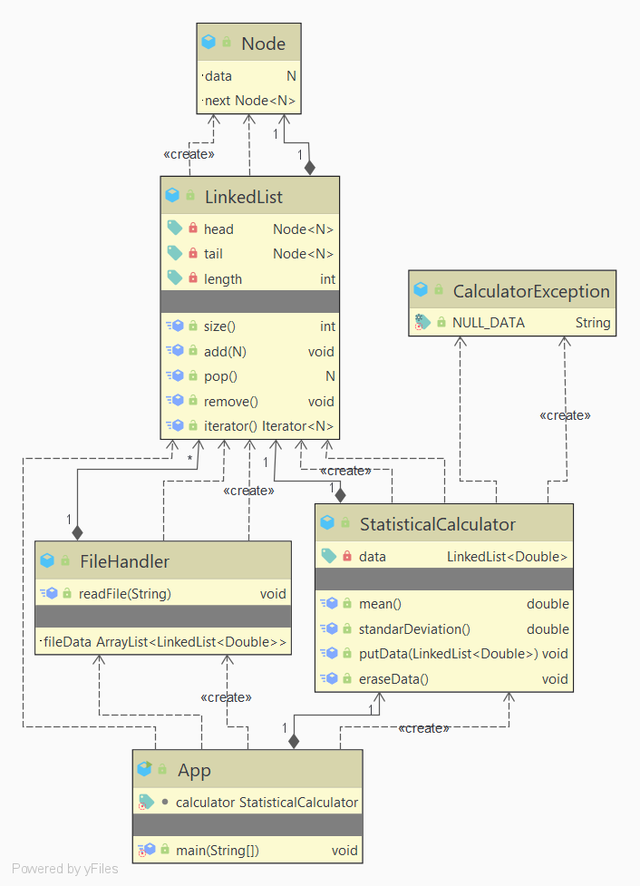
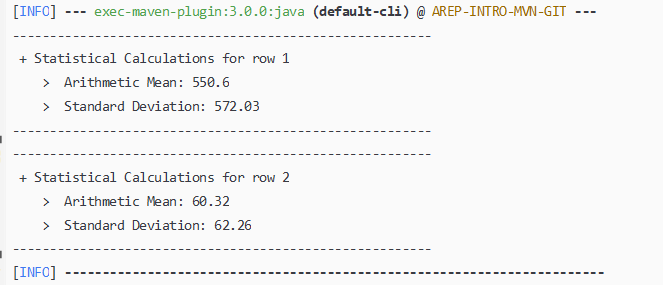

# Taller de Introducción a Maven y Git

## Descripción

Este repositorio contiene la implementación de una calculadora estadistica, usando como colección una lista enlazada simple, con el propósito 
de poner en práctica el uso de las herramientas tecnológicas Maven y Git.

## Diseño



## Comenzando

### Funcionalidades
La calculadora estadística, ofrece el cálculo del promedio de un conjunto de datos y su desviación estandar.

### Prerrequisitos
+ Java 8 SE JDK 
+ Maven
+ Git

### Instalación
Primero debemos clonar este repositorio con el siguiente comando:

`````
git clone https://github.com/D4v0r/AREP-INTRO-MVN-GIT
`````

Ahora debemos dirigirnos al directorio donde fue clonado el respositorio ejecutar una consola de comandos y compilar el proyecto con el siguiente comando:

````
mvn package
````

### Ejecución
Para ejecutar el programa debemos escribir el siguiente comando:

````
mvn exec:java -Dexec.mainClass="edu.escuelaing.arep.INTRO.app.App" -Dexec.args="dataTest2.txt"
````

Por defecto esto nos dará como resultado lo siguiente:



Para ejecutar el programa con los datos que necesitemos, debemos crear un archivo de texto en el directorio llamado "data", teniendo en cuenta que los datos que serán procesados en un solo calculo deben estar en la misma fila separados por un espacio en blanco así:

````
160 591 114 229 230 270 128 1657 624 1503
````

Para ver los calculos que el programa nos ofrece sobre nuestros datos debemos ejecutar de nuevo el comando  `mvn exec:java ...`  modificando el parametro `-Dexec.args` con el nombre de nuestro archivo de texto sin olvidar la extensión `.txt`.

### Documentación

Para generar la documentación en su máquina puede ejecutar el siguiente comando:
```
mvn javadoc: javadoc
```
También puede observarla [AQUÍ](https://d4v0r.github.io/AREP-INTRO-MVN-GIT/apidocs/index.html).


### Entorno de Pruebas

La pruebas se encuentran automatizadas utilizando el framework JUnit, puede ejecutarlas con el siguiente comando:
````
mvn test
````

## Desarrollo

Este proyecto fue desarrollado con:
+ Java 8
+ Maven
+ CircleCI

### Automatización

Integración continua usando la tecnología de CircleCi:

[](https://circleci.com/gh/D4v0r/AREP-INTRO-MVN-GIT)

## Autor

>Davor Javier Cortés Cardozo
>
>Estudiante de la Escuela Colombiana de Ingeniería Julio Garavito

## Licencia

Este proyecto está licenciado bajo la GNU General Public License v3.0, para más información ver la [LICENCIA](LICENSE.txt).
